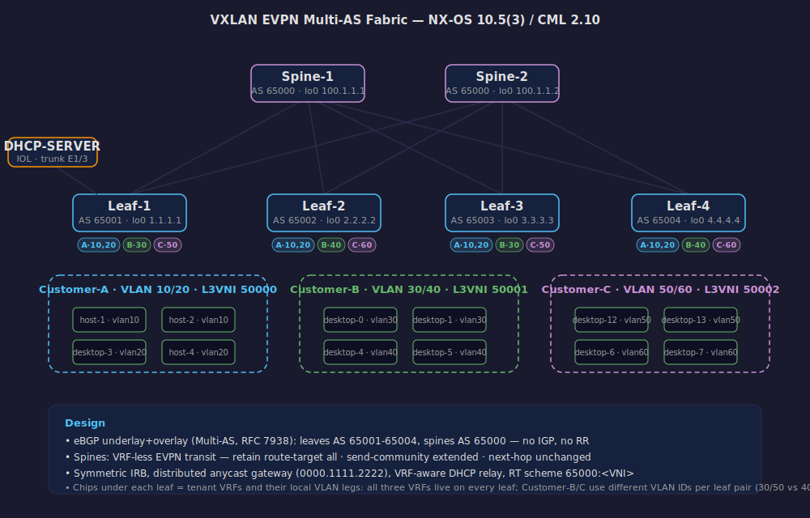

# Cisco NX-OS VXLAN EVPN Multi-AS Fabric — Multi-Tenant Lab

A complete **BGP EVPN VXLAN fabric** built on Cisco Nexus 9000v (NX-OS 10.5.3) in Cisco Modeling Labs 2.10, using the **Multi-AS (eBGP) underlay/overlay design** described in RFC 7938 — every leaf in its own autonomous system, spines acting as VRF-less eBGP transit.

**📖 Full documentation site:** https://enizaksoy.github.io/Cisco-VXLAN-EVPN-Multi-AS-Lab/



## Highlights

- **Multi-AS eBGP EVPN**: 4 leaves (AS 65001–65004), 2 spines (shared AS 65000) — no IGP, no route reflectors
- **Spines carry EVPN routes with zero VRF/VNI configuration** — `retain route-target all` + `next-hop unchanged`, the VXLAN analog of a VPNv4 route reflector
- **Multi-tenancy**: 3 customer VRFs with symmetric IRB (L2VNI + L3VNI per tenant)
- **Distributed anycast gateway** on every leaf (`fabric forwarding mode anycast-gateway`)
- **Centralized DHCP server** reached via VRF-aware DHCP relay — including a packet-level analysis of why a single relay "works" on a stretched L2VNI and why it must not be designed that way
- **Real troubleshooting journal**: every fault we hit (and fixed) is documented with the exact show-command evidence

## Tenant / VNI plan

| Tenant | VLANs | L2 VNIs | L3VNI (core VLAN) | Subnets |
|---|---|---|---|---|
| Customer-A | 10, 20 | 10, 20 | 50000 (vlan 500) | 172.16.10.0/24, 172.16.20.0/24 |
| Customer-B | 30, 40 | 30, 40 | 50001 (vlan 501) | 172.16.30.0/24, 172.16.40.0/24 |
| Customer-C | 50, 60 | 50, 60 | 50002 (vlan 502) | 172.16.50.0/24, 172.16.60.0/24 |

Route-target scheme (manual — `auto` derives `ASN:VNI` and never matches across different leaf ASNs in a Multi-AS design):

- L2 VNIs: `65000:<VNI>` — e.g. `65000:10`
- L3 VNIs: `65000:500X` — e.g. `65000:5001`

## Device inventory

| Device | Role | AS | Loopback0 |
|---|---|---|---|
| Spine-1 | eBGP transit | 65000 | 100.1.1.1 |
| Spine-2 | eBGP transit | 65000 | 100.1.1.2 |
| Leaf-1 | VTEP | 65001 | 1.1.1.1 |
| Leaf-2 | VTEP | 65002 | 2.2.2.2 |
| Leaf-3 | VTEP | 65003 | 3.3.3.3 |
| Leaf-4 | VTEP | 65004 | 4.4.4.4 |

Hosts are Alpine Linux "desktop" nodes plus an IOL router acting as the central DHCP server (attached to Leaf-1 on a trunk).

## The three Multi-AS spine rules

Without all three, the fabric silently fails in three different ways:

```
router bgp 65000
  address-family l2vpn evpn
    retain route-target all          ! (1) spine has no VRFs → default RT filter would drop everything
  neighbor <leaf>
    address-family l2vpn evpn
      send-community extended        ! (2) RTs are extended communities
      route-map unchanged out        ! (3) eBGP rewrites next-hop → would break VXLAN tunnel endpoint
```

```
route-map unchanged permit 10
  set ip next-hop unchanged
```

## Repository layout

```
├── configs/          # sanitized running-configs of all 6 switches
├── verification/     # show nve vni / bgp evpn summary / mac-ip / VRF routes per device
├── topology/         # CML 2.10 lab export (import-ready YAML)
├── docs/             # design notes, DHCP relay deep dive, troubleshooting journal
└── index.html        # GitHub Pages documentation site
```

## Troubleshooting journal (short version)

Every one of these produced a lesson worth keeping — full detail in [docs/troubleshooting-journal.md](docs/troubleshooting-journal.md):

1. **Type-5 routes generated but `invalid(EVI down)`** → L3VNI had no core VLAN + `ip forward` SVI. BGP refuses to advertise a route it cannot forward for.
2. **Copy-paste route-target typo** (`65000:30` under `vni 50`) → two tenants' control planes silently cross-imported.
3. **`vlan 503 / vn-segment 50003` instead of `502/50002`** → SVI `protocol-down/link-down/admin-up` is the fingerprint of "SVI exists, VLAN doesn't".
4. **`%ARP-2-DUP_SRC_IP` from an nve-peer** → same SVI IP on two leaves *without* anycast-gateway mode: each claimed the IP with its own system MAC.
5. **DHCP relay on one leaf only** → worked (BUM flooding delivered the Discover to the relay leaf) until that leaf went down and hosts on *other* leaves lost DHCP. "Working" ≠ "working by design".

## Requirements

- CML 2.10+ (2.7.2+ can import the YAML) with the `nxosv9000` 10.5(3) reference image
- ~24 GB RAM for the 6 switches; desktops are lightweight Alpine nodes
- Device credentials in the lab: `cisco / cisco`

## Related labs

- [cisco-multi-site-evpn-implementation](https://github.com/Enizaksoy/cisco-multi-site-evpn-implementation) — Multi-Site EVPN with AI-driven configuration
- [Multi-Vendor-VXLAN-EVPN-TEST-Cisco-Versa-Cumulus](https://github.com/Enizaksoy/Multi-Vendor-VXLAN-EVPN-TEST-Cisco-Versa-Cumulus) — multi-vendor EVPN interop
- [Juniper-MPLS-EVPN-Lab](https://github.com/Enizaksoy/Juniper-MPLS-EVPN-Lab) — the MPLS side of the same concepts

---

*Lab built and debugged interactively on Cisco Modeling Labs; configs and verification outputs collected live from the running fabric (July 2026).*
